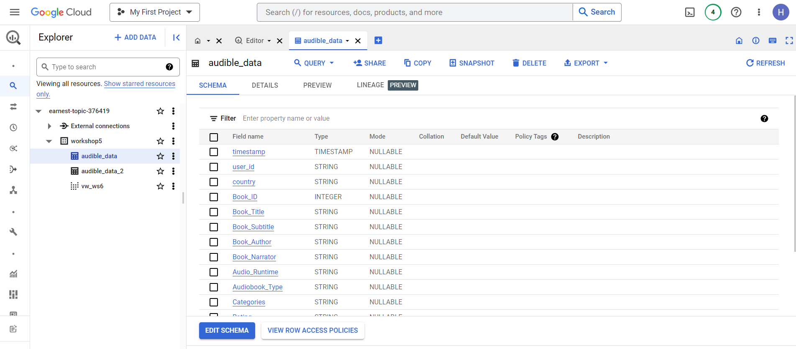

# Data Engineer End to End project on Google Cloud Platform (GCP)

## Collecting data, import to Data Lake on Google Cloud Storage 

## Automate extracted and transformed data via Data Pipeline managed by Apache Airflow

## Load clean data to the Data Warehouse on Google BigQuery 

## Data Visualization on Looker Studio (Google Data Studio)
### [Data Report on Looker Studio](https://lookerstudio.google.com/reporting/670e2ce7-c598-4ef4-953b-a3f09faea9c7)

